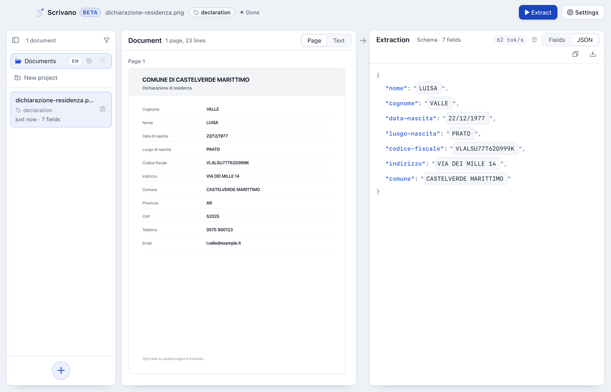

<div align="center">


# Scrivano

**Your Document AI assistant, fully offline.**

Point it at a digital born or scanned document and it tells you what kind of document it is, then
fills whatever JSON schema you hand it — on a laptop CPU, no API key, no network.
A 350M model fine-tuned for the job, bundled in a desktop app.

> **The project born as a toy excercise for finetuning and extending LFM-2.5-350M for italian and KIE. I am now having fun adding new capabilities!**


</div>



## What is new in 0.4.0

**The page says what language it is in.** Until now a folder said it, and a German page in a folder
of Italian ones got an Italian schema unless someone remembered to change it — which matters,
because keys, descriptions and class names go into the prompt in the document's language, and an
English schema over an Italian page measurably invents values.

- **Detected on open**, with fastText's `lid.176` (176 languages, under a megabyte, offline like
  everything else), narrowed to the model's eight. On the 458 validation pages of
  `xfund-docai-xl` it names the right language for 450, leaves three sparse memos to the folder's,
  and calls five English — English form templates filled in with German, Spanish and Portuguese
  values.
- **The folder's language becomes the fallback**: for a page in none of the eight, one with too
  few letters to tell, or one detection is less than even sure of. It can be switched off per
  folder, and one document's language can still be changed by hand in the extraction settings.
- **What can follow it, does.** An untouched preset becomes that language's preset. While the
  folder's class list is still the trained twelve, the model is shown it in the page's language,
  and the answer is filed under the folder's own name for the class, so a folder of mixed pages
  still groups under one set of tags. An edited schema or class list is somebody's work and goes
  as written.
- The document's language sits in the top bar, and says where it came from: the page, a choice,
  or the folder.
- The eye from 0.3.0 is now remembered by what a field means, not by its key, so an eye closed on
  `cognome` is closed on `nachname`. One with no counterpart in the new language comes along as its
  own row, still closed, and a full name closes with either of its parts: swapping a schema for
  another language's preset never opens an eye by the way.

[0.3.0](../../releases/tag/v0.3.0-beta) brought hiding a value; each release's notes are on its
[release page](../../releases).

## Links

| | |
|---|---|
| Model | [`andreagemelli/LFM2.5-350M-Extract-ML-LoRA`](https://huggingface.co/andreagemelli/LFM2.5-350M-Extract-ML-LoRA) |
| GGUF (shipped in the app) | [`…-ML-LoRA-GGUF`](https://huggingface.co/andreagemelli/LFM2.5-350M-Extract-ML-LoRA-GGUF) (Q8_0, 362 MiB; a Q4_K_M is there too) |
| Dataset | [`andreagemelli/xfund-docai-xl`](https://huggingface.co/datasets/andreagemelli/xfund-docai-xl) |
| Base model | [`LiquidAI/LFM2.5-350M`](https://huggingface.co/LiquidAI/LFM2.5-350M) |
| Downloads | [Releases](../../releases/latest) — macOS `.dmg`, Windows `.exe` / `.msi` |
| Sample form | [`examples/dichiarazione-residenza.pdf`](examples/dichiarazione-residenza.pdf) |
| Previous model / dataset | [`LFM2.5-350M-IT-Extract`](https://huggingface.co/andreagemelli/LFM2.5-350M-IT-Extract), [`xfund-kie-it`](https://huggingface.co/datasets/andreagemelli/xfund-kie-it) |

## Install

Grab the file for your machine from [**Releases**](../../releases/latest). The model is inside
it — nothing else downloads, no network needed. ~420 MB installed.

- **macOS** (Apple silicon) — open the `.dmg`, drag **Scrivano** into Applications. The build is
  unsigned, so first launch reports *"Scrivano is damaged"*. Clear the quarantine once:
  ```bash
  xattr -dr com.apple.quarantine "/Applications/Scrivano.app"
  ```
- **Windows** (x64) — run the `.exe` (NSIS) or `.msi`. SmartScreen: *More info* → *Run anyway*.

### From source

Needs Rust (stable), Node 22+, cmake, python3, the Hugging Face CLI (Windows also needs LLVM
with `LIBCLANG_PATH` set).

```bash
cd app
npm install
./scripts/fetch-resources.sh      # downloads the 4 bundled files; LFM_GGUF=/path to use a local gguf
npm run tauri dev                 # not `npm run dev` — that has no Tauri runtime
npm run build                     # installers; add `-- --bundles app` to skip the dmg step
npm test                          # prompt contract + redaction self-checks
```

## How it works

- **Reads** `pdf png jpg jpeg webp tif tiff`. PDFs render at 200 DPI; a page's text layer is used
  directly when it yields >50 chars, else OCR (PP-OCRv5 + Latin recognition, Rust/ONNX).
- **Detects the language, then classifies.** As soon as the text is in, the page's language is read
  off it, then one of twelve classes is asked for, in that language. There is nothing to configure
  per run, so there is no button. The class list belongs to the project the document was opened
  into — turn it off, or edit it, from the gear beside the project name.
- **You declare the fields** as `key` + `description` rows. New docs start with a 7-field preset,
  drawn from the keys that language's own training rows carry most often, in the language the page
  was detected in. Keep the schema tight, and if detection got the language wrong, set *Documents
  are in* by hand. It is not a cosmetic setting: on an Italian page an English schema invented an
  email address that was not on it and read the postcode as a phone number, while the Italian
  schema returned every field correctly.
- **Streams the JSON**, points values back at the page on hover, and flags values that appear
  nowhere on the page as likely inventions.
- **Hides what you tell it to.** A field's eye replaces its value with `[REDACTED]` in the JSON
  and the text, and paints it black on the page and in the exported PDF.
- **Projects.** Documents live in folders. A folder carries the language its documents are
  written in and the classes they can be given, so it decides what a new document in it starts
  from: a folder of Italian invoices and a folder of German forms want neither the same schema nor
  the same class list. Group and sort a folder by class from the filter in the rail.
- **Two languages, two different questions.** The interface speaks English or Italian. The
  documents can be in any of the model's eight, and that is the one that matters: keys,
  descriptions and class names go into the prompt in the document's language, because that is how
  the model was trained. Each page's language is detected as it opens (fastText `lid.176`); the
  folder's is the fallback.
- Decoding (temperature, top-k/p, max tokens, seed) is configurable; temperature 0 by default.

The published F1 assumes the model is told which fields the document contains — *you* supply that
by scoping the schema. This is a 350M model: read the output, don't trust it.

## Does the fine-tune work?

Measured on the 785-row val split of `xfund-docai-xl`, greedy decoding. A non-parsing output is
scored 0 and kept in the average, so these numbers already carry their own failures.

| Model | Avg F1 | Non-parsing |
|---|---|---|
| `LiquidAI/LFM2.5-350M` (base, zero-shot) | 0.2640 | 195 / 723 |
| `andreagemelli/LFM2.5-350M-IT-Extract` (0.1.x, Italian + extraction only) | 0.2229 | 229 / 723 |
| full fine-tune, same data and schedule | 0.7364 | 6 / 785 |
| **`andreagemelli/LFM2.5-350M-Extract-ML-LoRA`** (shipped) | **0.7504** | **3 / 785** |

Per task: extraction **0.7617**, classification **0.7364**. Per language, best to worst: zh 0.88,
de 0.81, fr 0.81, ja 0.77, es 0.74, it 0.73, en 0.63, pt 0.59. The Q8_0 quant the app ships scores
the same to within noise.

Two things worth reading twice. The base model's 0.26 is mostly a **formatting** failure — 195 of
723 outputs were not JSON at all; it understands the pages better than the number says, it just
does not obey the output contract. And the Italian-only predecessor is **worse than base overall**:
it collapses on classification (0.02, 155 unparseable) because it never saw the task, while being
better than base at exactly what it was trained on. That is what overfitting looks like from the
inside.

These are still **upper bounds**: the schema handed to the model lists exactly the keys the page
answers, and the metric double-counts a wrong value as both a miss and a false positive.

Reproduce (Python 3.14 + [uv](https://docs.astral.sh/uv/)):

```bash
uv sync
uv run main.py                                  # shipped model, full val split
uv run main.py --model-id LiquidAI/LFM2.5-350M  # base baseline
uv run main.py --model-id andreagemelli/LFM2.5-350M-Extract-ML-LoRA-GGUF \
               --gguf-file LFM2.5-350M-Extract-ML-LoRA-Q8_0.gguf   # score the shipped quant
uv run main.py --limit 5 --debug                # per-doc prompt, expected, got, tok/s
```

How the dataset was built — the per-language label→key rules, where the class labels come from,
and the 400 generated pages — is in the
[dataset card](https://huggingface.co/datasets/andreagemelli/xfund-docai-xl).

## Shortcomings

Beta. Sensitive to the schema descriptions (edit those before blaming the document, and prefer the
presets, which carry the exact wording the fine-tune saw). Single-page documents only. JSON is not
guaranteed — 3 of 785 val outputs did not parse, and the app recovers pairs from truncated output.
A right-looking value in the wrong field is not flagged. The twelve classes are heuristic, read off
page titles rather than annotated, and English classification leans almost entirely on generated
pages. Portuguese and English are the weakest languages. macOS builds are unsigned; history is
capped at 50 docs storing pages as base64. Hiding is only as good as the extracted value: it
blacks out that text where it occurs, so a value the model got wrong is flagged, not hidden. The
box is placed from each word's position (the OCR's own character columns, or the PDF's own font)
and padded outward, so it can take a letter of the label beside it; a line with no word positions
— a document read by an older version, or a line the OCR misread — is blacked out whole.

## Next Steps
- [x] Refine the finetuning with more data
- [x] Check multilinguality still holds (italian will remain the central scope though)
- [x] Add Document Classification pipeline
- [x] Add PII pipeline — hide an extracted value in the JSON, the text and the PDF (0.3.0)
  - [ ] Train a dedicated PII model, so personal data is found and hidden without a schema field
    for each kind of it
- [x] Detect the document's language instead of being told it (0.4.0)
- [ ] Re-classify on demand, not only on open
- [ ] Move documents between projects, and open a whole folder at once

## Licence

**CC BY-NC-SA 4.0** — see [`LICENSE`](LICENSE), full breakdown in [`NOTICE`](NOTICE). Inherited
from XFUND and FUNSD (the training data) and stacked with the base model's LFM Open License v1.0;
the NonCommercial term governs. Retrain on non-XFUND data and the chain no longer binds.
